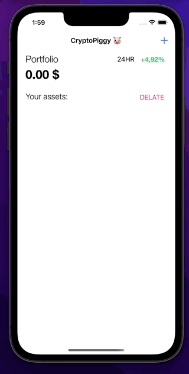
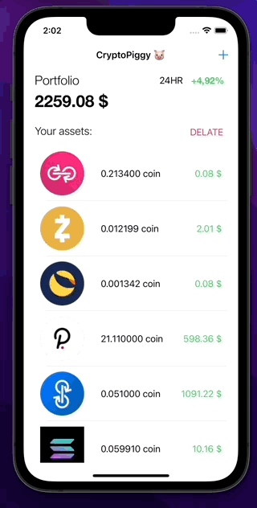
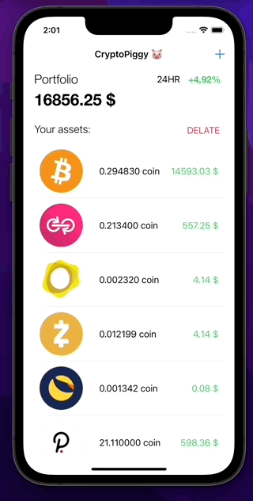
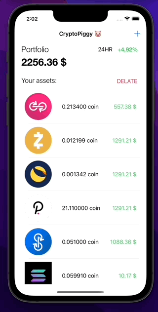

# CryptoPiggyBank
Swift version of Piggy Bank but for cryptocoins! 

This app allows the user to add coins and automatically calculates the value of the user's portfolio.  
Using CoreData users don't have to worry about closing of the app - all data will be there all the time.  

## Demo

 

## Description

This app is based on [coinapi](https://www.coinapi.io/) and also [cryptoicon-api](https://cryptoicon-api.vercel.app/).  
I have been downloading data from these services and create UI/UX to allow users to save coins.  
As data storage, I am using CoreData where I am storing a single Asset object.  
This allows users to complete close the app and still have all data saved.   
Video below shows this process:   

 

## Deleting data
Users can delete a single transaction just by swiping it out.  
On the other hand, if the user wants to delete all his coins from the bank he can just press the red delete button.  
In the first and second cases, selected data will be deleted from CoreData.  
Video below shows this processes:   

   

   

## Room for improvements

In a future version of the app, first screen containing the change of value in the last 24 hours will be working.  
This version has this hardcoded. Unfortunately API version that I have been using doesn't have this data.  
